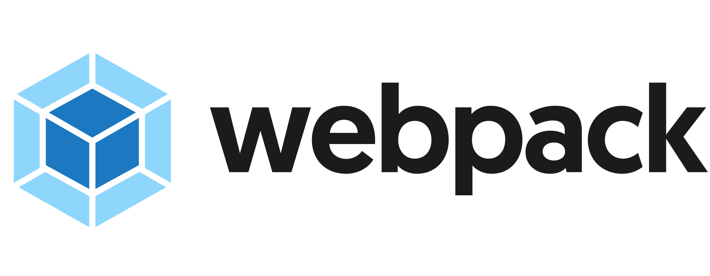

# 🏗 Ogma Build Systems

## 💡 Information

This repository holds build system templates for Ogma.

It is _work in progress_, we plan to add: TypeScript, Vite, Rollup and Webpack templates.

## 🚀 Get started

**Requirements :** [NPM](https://npmjs.com/) or [Yarn](https://yarnpkg.com/)

These templates are meant to be used as is via the [degit](https://github.com/Rich-Harris/degit) utility.

##  TypeScript

```sh
# TypeScript template
$ npx degit Linkurious/ogma-build-systems/typescript my-typescript-project
$ cd my-typescript-project
$ npm install # or yarn install
```

##  Vite

```sh
# Vite template
$ npx degit Linkurious/ogma-build-systems/vite my-vite-project
$ cd my-vite-project
$ npm install # or yarn install
```

##  Rollup

```sh
# Rollup template
$ npx degit Linkurious/ogma-build-systems/rollup my-rollup-project
$ cd my-rollup-project
$ npm install # or yarn install
```

##  Webpack

```sh
# Webpack template
$ npx degit Linkurious/ogma-build-systems/webpack my-webpack-project
$ cd my-webpack-project
$ npm install # or yarn install
```

##  Node.js

```sh
# node.js template
$ npx degit Linkurious/ogma-build-systems/node my-node-project
$ cd my-node-project
$ npm install # or yarn install
$ npm run build
```

##  Parcel

```sh
# Parcel template
$ npx degit Linkurious/ogma-build-systems/parcel my-parcel-project
$ cd my-parcel-project
$ npm install # or yarn install
$ npm run build
```

## 👀 I don't see a template that matches my need?

You wish there was a template with your favorite library? Feel free to make a pull request. Copy one of the template already available, tweak it, name it properly and make a PR.
