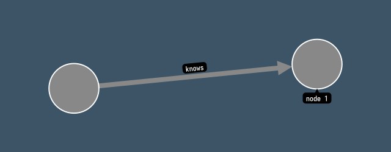

# 🏗 Node.js Template for Ogma

## 💡 Information

This repository holds Node.js template for Ogma. To learn more about how to use it, you can consult our [documentation](https://ogma.linkurio.us) and [tutorial](https://doc.linkurious.com/ogma/latest/tutorials/nodejs-export/index.html). It shows how to use Ogma to render graphs in Node.js.

## 🚀 Get started

**Requirements :** [NPM](https://npmjs.com/) or [Yarn](https://yarnpkg.com/)

### Download this boilerplate

```sh
npx degit Linkurious/ogma-build-systems/node ogma-node-project
cd ogma-node-project
```

Before running this example, please replace `YOUR_ACCESS_KEY` with your API key (which you can get from [here](https://get.linkurio.us)) in `package.json`. You will need `node-canvas` for the PNG export and `xmldom` for SVG export.

In this example, you can install them using `npm i`.

## 📝 Usage

To run the example, use `npm start`. This will generate a `graph.png` file in the root of the project. Note using custom fonts in this example.


